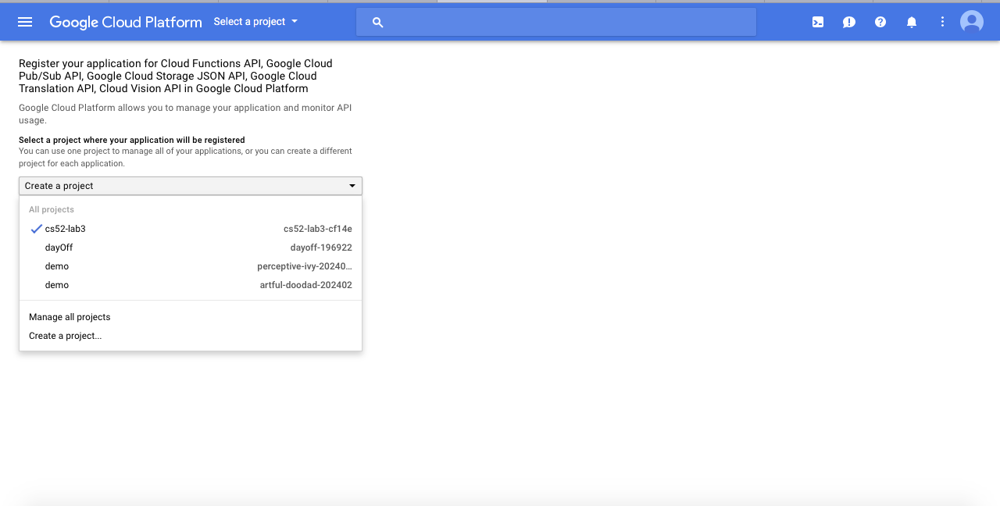

# CS52 Workshops:  TITLE OF YOUR WORKSHOP


Brief motivation here as well as in presentation

## Overview

Summary of what we're about to do.

## Setup

### Claim your Google Cloud coupon:
[click here](http://google.force.com/GCPEDU?cid=UzeQ%2BFSDq8F8BkKEc7z4cucNPVp72amu49U8rxFokiNys%2FhH7RJAepaB5I7IWvbC/)

Enter your Dartmouth email and name. Then go to your email to verify it.

After verifying your email, you should receive another email with your coupon code. Click the link they provided. You might have to sign in to your google account if you aren’t signed in already.

### Create New Project
Now you have to create a new project in your google account. [click here](
https://accounts.google.com/ServiceLogin/signinchooser?service=cloudconsole&passive=1209600&osid=1&continue=https%3A%2F%2Fconsole.cloud.google.com%2Fcloud-resource-manager%3F_ga%3D2.56200875.-1003825271.1520127443%26ref%3Dhttps%3A%2F%2Faccounts.google.com%2FLogout%3Fservice%253Dcloudconsole%2526continue%253Dhttps%3A%2F%2Fconsole.cloud.google.com%2Fcloud-resource-manager%3F_ga%25253D2.56200875.-1003825271.1520127443%2526hl%253Den_US&followup=https%3A%2F%2Fconsole.cloud.google.com%2Fcloud-resource-manager%3F_ga%3D2.56200875.-1003825271.1520127443%26ref%3Dhttps%3A%2F%2Faccounts.google.com%2FLogout%3Fservice%253Dcloudconsole%2526continue%253Dhttps%3A%2F%2Fconsole.cloud.google.com%2Fcloud-resource-manager%3F_ga%25253D2.56200875.-1003825271.1520127443%2526hl%253Den_US&flowName=GlifWebSignIn&flowEntry=ServiceLogin)

### Enable billing for project:
Go to [this link](https://console.cloud.google.com/billing) to see your billing accounts.

*If you only have one, move on to ENABLE API section.*

If you have multiple, do the following:

1. Go to the Google Cloud Platform Console.
Open the console left side menu and select Billing.

2. If you have more than one billing account, you'll be prompted to select Go to linked billing account to manage the current project's billing.

3. Under Projects linked to this billing account, locate the name of the project that you want to change billing for, and then click the menu next to it (3 dots).


Our project is called demo.


Select Change billing account, then choose the desired destination billing account.
Click Set account.

### Enable API:
[click here to enable the API for your project](https://accounts.google.com/ServiceLogin/signinchooser?service=cloudconsole&passive=1209600&osid=1&continue=https%3A%2F%2Fconsole.cloud.google.com%2Fflows%2Fenableapi%3Fapiid%3Dcloudfunctions%2Cpubsub%2Cstorage_api%2Ctranslate%2Cvision.googleapis.com%26redirect%3Dhttps%3A%2F%2Fcloud.google.com%2Ffunctions%2Fdocs%2Ftutorials%2Focr%26_ga%3D2.26854077.-1003825271.1520127443&followup=https%3A%2F%2Fconsole.cloud.google.com%2Fflows%2Fenableapi%3Fapiid%3Dcloudfunctions%2Cpubsub%2Cstorage_api%2Ctranslate%2Cvision.googleapis.com%26redirect%3Dhttps%3A%2F%2Fcloud.google.com%2Ffunctions%2Fdocs%2Ftutorials%2Focr%26_ga%3D2.26854077.-1003825271.1520127443&flowName=GlifWebSignIn&flowEntry=ServiceLogin)



Click select a project at the top and choose your project name. Then click Open.

You should be at a page that looks like this.


If you don't have the sidebar on the left, click the three horizontal menu bars on the top left.

From this sidebar, click `APIs & Services` and then click `Dashboard`.

You should be taken to a page that looks like this.


Scroll to the bottom that has a list of APIs and click `Cloud Vision Api`.

If Cloud Vision is not enabled, you should be taken to a page that looks like this.


Click Enable at the top.

If Cloud Vision is already enabled, you would just see a disable option. So do nothing.

#### Authentication
If you haven't already, create a new local folder on your computer for the project you're about to start.

To use this client library, you must first authenticate. Complete these steps:

Go to the Create service account key page in the GCP Console: [Service account key page](https://console.cloud.google.com/apis/credentials/serviceaccountkey?_ga=2.231760415.-1003825271.1520127443&project=perceptive-ivy-202402&folder&organizationId)

Make sure your project name is showing at the top and it is the right project. (ours is called demo)


From the Service account drop-down list, select New service account.

Enter a name into the Service account name field.

From the Role drop-down list, select Project > Owner.

Click Create. A JSON file that contains your key downloads to your computer. Save in your project folder.

### Initial Environment Set-up/Checks:
First check the npm version you have installed currently using `npm -v`
If you don't have version `9.8.0` you need to rollback your version.
Run the following in your terminal:

`npm install --global node@9.8.0`


## Step by Step

* Explanations of the what **and** the why behind each step. Try to include:
  * higher level concepts
  * best practices

Remember to explain any notation you are using.

```javascript
/* and use code blocks for any code! */
```


:sunglasses: GitHub markdown files [support emoji notation](http://www.emoji-cheat-sheet.com/)

Here's a resource for [github markdown](https://guides.github.com/features/mastering-markdown/).


## Summary / What you Learned

* [ ] can be checkboxes

## Resources

* cite any resources
