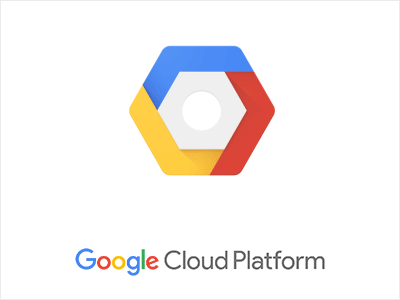
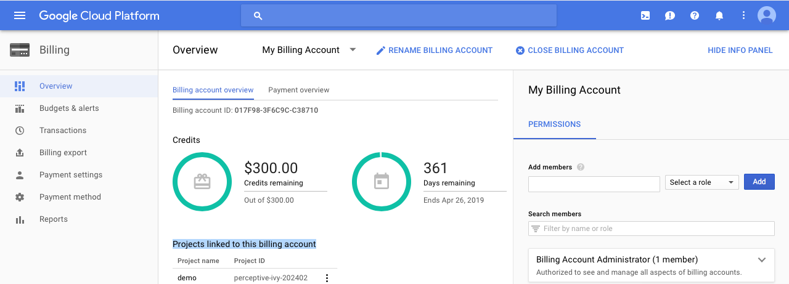
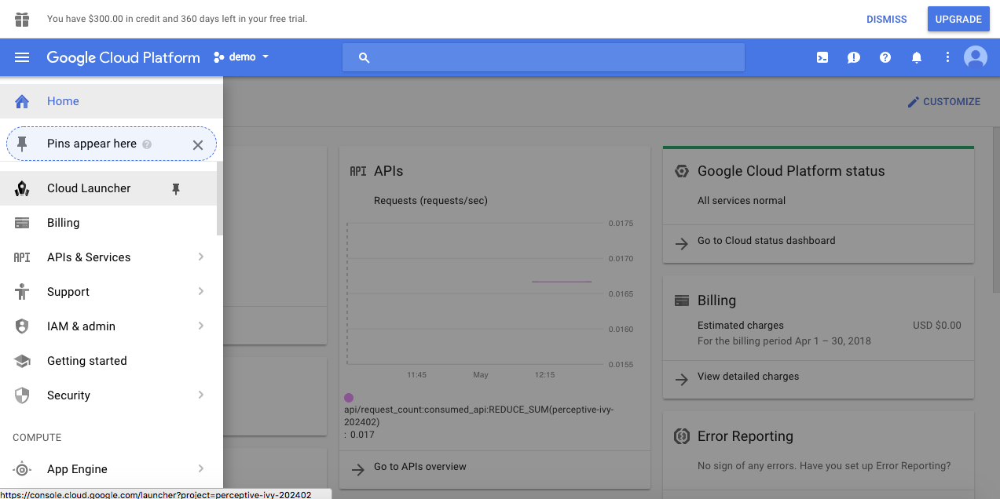
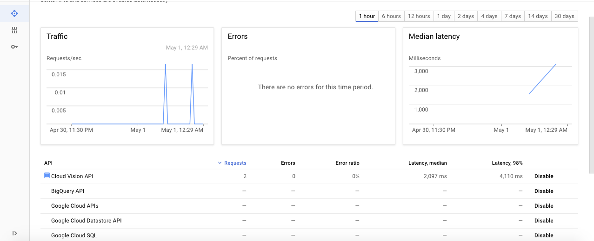
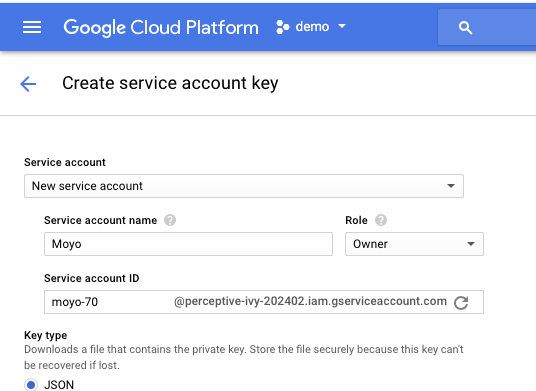

# CS52 Workshops:  Google Cloud Vision API



In our presentation we talked about using different APIs like IBM'S Watson, Microsoft's Azure, and Google's Cloud Vision, to quickly add Artificial Intelligence to our applications. We want to introduce you to the Google Cloud API, which will allow you to get insight from images.

## Overview

The Google Cloud Vision API allows us to understand the contents of an image. You can use it for label detection, logo detection, explicit content detection, face detection, image attributes, web detection, and more. But, today, we are going to use the Google Cloud Vision API to identify an uploaded image.

## Setup

### Claim your Google Cloud coupon:
[click here](http://google.force.com/GCPEDU?cid=UzeQ%2BFSDq8F8BkKEc7z4cucNPVp72amu49U8rxFokiNys%2FhH7RJAepaB5I7IWvbC/)

Enter your Dartmouth email and name. Then go to your email to verify it.

After verifying your email, you should receive another email with your coupon code. Click the link they provided. You might have to sign in to your google account if you aren’t signed in already.

### Create New Project
Now you have to create a new project in your google account. [click here](
https://accounts.google.com/ServiceLogin/signinchooser?service=cloudconsole&passive=1209600&osid=1&continue=https%3A%2F%2Fconsole.cloud.google.com%2Fcloud-resource-manager%3F_ga%3D2.56200875.-1003825271.1520127443%26ref%3Dhttps%3A%2F%2Faccounts.google.com%2FLogout%3Fservice%253Dcloudconsole%2526continue%253Dhttps%3A%2F%2Fconsole.cloud.google.com%2Fcloud-resource-manager%3F_ga%25253D2.56200875.-1003825271.1520127443%2526hl%253Den_US&followup=https%3A%2F%2Fconsole.cloud.google.com%2Fcloud-resource-manager%3F_ga%3D2.56200875.-1003825271.1520127443%26ref%3Dhttps%3A%2F%2Faccounts.google.com%2FLogout%3Fservice%253Dcloudconsole%2526continue%253Dhttps%3A%2F%2Fconsole.cloud.google.com%2Fcloud-resource-manager%3F_ga%25253D2.56200875.-1003825271.1520127443%2526hl%253Den_US&flowName=GlifWebSignIn&flowEntry=ServiceLogin)

### Enable billing for project:
Go to [this link](https://console.cloud.google.com/billing) to see your billing accounts.

*If you only have one, move on to ENABLE API section.*

If you have multiple, do the following:

1. Go to the Google Cloud Platform Console.
Open the console left side menu and select Billing.

2. If you have more than one billing account, you'll be prompted to select Go to linked billing account to manage the current project's billing.

3. Under Projects linked to this billing account, locate the name of the project that you want to change billing for, and then click the menu next to it (3 dots).


Our project is called demo.


Select Change billing account, then choose the desired destination billing account.
Click Set account.

### Enable API:
[click here to enable the API for your project](https://accounts.google.com/ServiceLogin/signinchooser?service=cloudconsole&passive=1209600&osid=1&continue=https%3A%2F%2Fconsole.cloud.google.com%2Fflows%2Fenableapi%3Fapiid%3Dcloudfunctions%2Cpubsub%2Cstorage_api%2Ctranslate%2Cvision.googleapis.com%26redirect%3Dhttps%3A%2F%2Fcloud.google.com%2Ffunctions%2Fdocs%2Ftutorials%2Focr%26_ga%3D2.26854077.-1003825271.1520127443&followup=https%3A%2F%2Fconsole.cloud.google.com%2Fflows%2Fenableapi%3Fapiid%3Dcloudfunctions%2Cpubsub%2Cstorage_api%2Ctranslate%2Cvision.googleapis.com%26redirect%3Dhttps%3A%2F%2Fcloud.google.com%2Ffunctions%2Fdocs%2Ftutorials%2Focr%26_ga%3D2.26854077.-1003825271.1520127443&flowName=GlifWebSignIn&flowEntry=ServiceLogin)


Click select a project at the top and choose your project name. Then click Open.

You should be at a page that looks like this.



If you don't have the sidebar on the left, click the three horizontal menu bars on the top left.

From this sidebar, click `APIs & Services` and then click `Dashboard`.

You should be taken to a page that looks like this.



Scroll to the bottom that has a list of APIs and click `Cloud Vision Api`.

If Cloud Vision is not enabled, you should be taken to a page that looks like this.


Click Enable at the top.

If Cloud Vision is already enabled, you would just see a disable option. So do nothing.

#### Authentication
If you haven't already, create a new local folder on your computer for the project you're about to start.

To use this client library, you must first authenticate. Complete these steps:

Go to the Create service account key page in the GCP Console: [Service account key page](https://console.cloud.google.com/apis/credentials/serviceaccountkey?_ga=2.231760415.-1003825271.1520127443&project=perceptive-ivy-202402&folder&organizationId)

Make sure your project name is showing at the top and it is the right project. (ours is called demo)



From the Service account drop-down list, select New service account.

Enter a name into the Service account name field.

From the Role drop-down list, select Project > Owner.

Click Create. A JSON file that contains your key downloads to your computer. Save in your project folder.

### Initial Environment Set-up/Checks:
First check the npm version you have installed currently using `npm -v`
If you don't have version `9.8.0` you need to rollback your version.
Run the following in your terminal:

`npm install --global node@9.8.0`


## Step by Step 🔢

First, fork this repo to get all of the starter code necessary to run the project.

`cd` into the root directory of the repo and run `npm install` to install all of the package dependencies.

:bangbang: **Make sure that you're running version `9.8.0` of node. Otherwise, running `npm install` will cause a lot of nasty errors**

This is going to be a mini React App that takes in an image and returns a label describing what is in the image (image recognition). The React app runs an Express server to send `POST` requests to the Google API server. As a reminder, a `POST` request requests that a web server accepts the data enclosed in the body of the request message. In our case, this data is an image. For example, say we upload the following image:


The Google API server will return a JSON file that looks something like this:

```json
{
  "responses": [
    {
      "labelAnnotations": [
        {
          "mid": "/m/0bt9lr",
          "description": "dog",
          "score": 0.97346616
        },
        {
          "mid": "/m/09686",
          "description": "vertebrate",
          "score": 0.85700572
        },
        {
          "mid": "/m/01pm38",
          "description": "clumber spaniel",
          "score": 0.84881884
        },
        {
          "mid": "/m/04rky",
          "description": "mammal",
          "score": 0.847575
        },
        {
          "mid": "/m/02wbgd",
          "description": "english cocker spaniel",
          "score": 0.75829375
        }
      ]
    }
  ]
}
```

 containing the identification tags for the image sent.

 But wait, what's Express?! :scream: Sneak peek to the short assignment coming out today: Express is a server-side JavaScript framework that adds another dimension to the layers of web development that we've already learned. It’s a lightweight framework that gives developers extra, built-in web application features.

 In our case, the Express server is used to facilitate the client-server interaction between our app and the Google Cloud Vision API.

 Without further ado, let's get started!
 
 

1. In the `src` directory, create a file titled `index.js` and copy and paste the following code into the file:

```react
import React from "react";
import ReactDOM from "react-dom";
import "./index.css";
import App from "./App";

ReactDOM.render(<App />, document.getElementById("root"));
```
You should be a React expert by now, so you'll know that this file takes in an `App` component and renders the HTML element with the `#root` id with that component. We could put all of the React code into this file and the app would run just fine; however, as we've learned with Redux, it's better to include the `App` component in a separate file and render it from there because it keeps the app more organized.

2. Also in the `src` directory, create an `App.js` file and copy and paste the following code into the file:

```react
import React, { Component } from "react";
import "./App.css";

class App extends Component {
  constructor(props) {
    super(props);
    this.state = {
      image: "",
      identification: ""
    };
  }

  render() {
    return (
      <div>
        Google Visiony things will be happening here soon 👀
      </div>
    );
  }
}

export default App;
```

No further explanation needed here – at this point, you should be able to create a new React component in your sleep 😴. Now, open you terminal and run `npm start`. A new tab should open in your browser with the app. Ooooh, magic 💥


(jk, it's actually an `npm` package called `react-scripts`)

3. Now, make a new directory called `server` and in it, a new file called `server.js`. This is where our mini-Express server will go. Copy and paste the following code into the file:

```react
const express = require("express");
const app = express();
const bodyParser = require("body-parser");
const multer = require("multer");
const path = require("path");
const storage = multer.memoryStorage();
const upload = multer({ storage: storage });
const vision = require("@google-cloud/vision");
const client = new vision.ImageAnnotatorClient({
  keyFilename: '../key.json',
  project_id: "YOUR-PROJECT-NAME"
});

app.use(bodyParser.json());

app.post("/upload", upload.single("myImage"), function(req, res) {
  client
    .webDetection(req.file.buffer)
    .then(results => {
      const webDetection = results[0].webDetection;
      var identification = { breed: webDetection.webEntities[0].description };
      console.log(webDetection.webEntities[0].description);
      res.json(webDetection.webEntities[0].description);
    })
    .catch(err => {
      console.error("ERROR:", err);
    });
});

app.listen(3001);
```
Woah, that's a lot of code! Make sure you have the 🔑 `key.json` file in your root directory and that you replace `YOUR-PROJECT-NAME` with the name of the project you created earlier. If you don't remember the name of the project, you can find it in your `key.json` file.

Now, let's understand what this code is doing.

This code creates an Express server that handles all of the `POST` requests to the Google Vision API via the route `\upload`. The `POST` request is uploading something called `myImage`, which will contain the data of the images you'll be uploading to the app later. The request returns a response JSON that is parsed and any errors are handled when necessary. To start this server, we'll run `node server.js` later, and the server will listen at port `3001` for any changes. 

4. Now, go back to your `App.js` file and add the following code in the return statement of your render function:
```react
<div>
  <header>
    <h1>CS52's Google Cloud Vision Image Identifier Workshop!</h1>
  </header>
  <div className="uploadForm">
     <h3>Upload Image</h3>
     <input type="file"/>
     <button onClick={this.postImg}>Click to identify</button>
  </div>
  <div />
  <h3>{this.state.identification}</h3>
</div>
```

These are just some basic HTML components to prepare to allow you to upload photos.

5. Above the render function, add the following function:
```react
postImg = () => {
    var formData = new FormData();
    formData.append("myImage", this.state.image);
    fetch("/upload", {
      method: "POST",
      body: formData
    })
      .then(response => {
          if(response.status === 200) return response.json();
          else {
            console.log(response);
            return { error: 'there was an error with response' }
          }
      }).then(response => {
        if(response.error) { console.log(response); }
        else {
          this.setState({ identification: response })
        }
      });
  };
```

Uh oh, more HTTP requests 😰. This function actually isn't that complicated when you take another look at it. Can you guess what it does? `postImg` would be presumably called on some action and it takes in the current state of the uploaded image, converts it to an HTTP request-friendly format, and sends it via the response. The function then handles the response, either updating the state `identification` or console logging the error.

6. Now lets go back to the render function. You'll notice that the call to change the state of `image` isn't defined. Can you figure out how to add it in?

*Hint 1: when should the state change be called?

*Hint 2: set the state of `image` to `e.target.files[0]`.

If you can't figure it out, scroll to the bottom of the README for the answer 😅.

Great, now you should have all the code you'll need to run the app!


### Putting it all together

Run `npm start` again in the root directory of your repo or refresh your browser tag. This is what you should see:


Now, open a second tab in your terminal and `cd` into the `server` directory. Once there, run `node server.js`. This will run the server concurrently with your web app. Remember, the server handels all of your reuqests to the Google Vision API and needs to run in order for your images to be processed correctly. 

Navigate back to the browser tab and click on the first button. Upload any image (if you need an image, feel free to use the image of the dog we included earlier – it's in the `Rimg` directory in the repo). Then, click `Click to identify`. Voilà, after a few seconds, a tag will appear below the input fields, effectively identifying your image! Play around with different images and the other button that handles OCR to get a feel for the API. 

### Extra Credit ⭐
We've already added two buttons for you: Label Detection and OCR. Add another button for face recognition and get it to work for additional bonus points! (For hints, look at the `server.js` code again and check out the [Google Vision API source code](https://github.com/googleapis/nodejs-vision/blob/master/samples/detect.js) for reference).

## Summary / What you Learned

* [X] React recap
* [X] Implementing Google Cloud Vision API
* [X] Intro to APIs
* [X] Intro to Express

## What to turn in
* The URL to your forked repo
* A screen shot of the face recognition button working for you if you attempted the extra credit

## Sources
* This tutorial was based off of [this](https://github.com/brianhallerweb/google_cloud_vision_img_identifier) repo created by `brianhallerweb` on GitHub.

## Resources
* [Google Cloud Vision API documentation](https://cloud.google.com/vision/docs/)
* [Google Cloud Vision API sample code](https://github.com/GoogleCloudPlatform/cloud-vision)

### Answer to state change question
` <input type="file" onChange={e => this.setState({ image: e.target.files[0] })} />`
